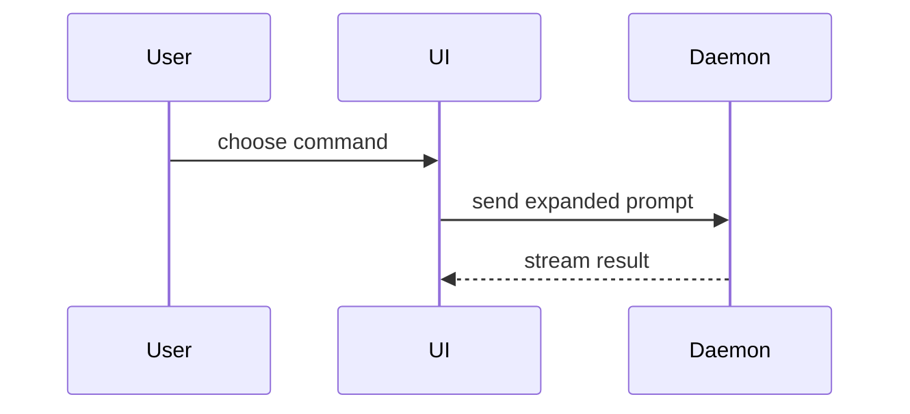

# Lost Me

The user just said your last message did not land. Skip the preamble and repair it. Match the repair to the signal they gave; re-pitch is the default.

## Re-pitch it

For "I don't follow" or jargon overload. Restate your last message so it lands: open with a little context — where things stand, what just happened — then make the point simply and concisely, like one human talking to another. No jargon. When precision matters, use ASD-STE100 Simplified Technical English. If the repo has a GLOSSARY.md, use its ubiquitous language (GLOSSARY-MAP.md points to the right one when there are several). Do not add new substance while re-pitching — restate what was said, and mark what was vague as vague instead of filling it in.

## Show it

For "show me", or when a re-pitch already failed: make the point visually. Pick the smallest view that makes the key point clear. Write any pseudocode in the codebase's dominant programming language — Java 21 when Java dominates or no language does, per the tech-spec convention; the agent's own tool-call code doesn't count.

- Show logic or an algorithm as pseudocode:

```text
on(save)
  if content is unchanged
    return cached result
  write new content
  return fresh result
```

- Show runtime control flow as a call tree:

```text
submitForm
  createSession
    persistPrompt
    launchAgent
  navigateToSession
```

- Show UI structure as a component tree, including state and module boundaries that matter:

```tsx
<SessionPage> (apps/example/src/routes/session.tsx)
  useSessionEvents()
  <SessionToolbar>
    <RunSkillButton> (packages/ui)
```

- Show file responsibility or a broad refactor as a shallow file tree:

```text
src/
├── commands/       # parses user actions
├── sessions/       # owns session state
└── transport/      # sends API requests
```

- Show component interaction, control flow, or data flow with Mermaid — only when the diagram itself is the point, such as several participants trading messages or a cycle in the flow. A call tree, a list, or a sentence that already makes the point wins:



- Use `diff` when the point is what changes and the surrounding shape already exists. Match the diff shape to the topic.

For a component change:

```diff
 <SessionPage>
   useSessionEvents()
   <SessionToolbar>
+    <RunSkillButton />
   <SessionTimeline>
+    <SkillResultCard />
```

For a file-layout change:

```diff
 src/
 ├── commands/
+│   └── lost-me.ts       # expands the slash command
 ├── sessions/
-└── transport.ts
+└── transport/
+    ├── client.ts
+    └── stream.ts
```

For a call-tree or call-stack change:

```diff
 submitForm
   createSession
     persistPrompt
+    expandSkillMention
     launchAgent
-  navigateToSession
+  navigateToSession
+    subscribeToEvents
```

For a state or control-flow change:

```diff
 on(save)
-  write content
+  if content is unchanged
+    return cached result
+  write new content
+  invalidate cache
```

- Show the whole block when most of it is new, when omitted context would hide ownership or order, or when the user needs a copyable target shape:

```ts
function expandSkill(command: string): string {
  const skillName = command.slice(1)
  return `use the ${skillName} skill`
}
```

- For a visual UI, layout, state comparison, or concept too dense for Mermaid, write one focused HTML file — a diagram, an infographic, or a short slide deck, whichever fits the point. Match the product's colors, type, spacing, and components; use real labels and data; support desktop and mobile. Then open it for the user:

```
open path/to/lost-me-{description}.html
```

### Guidance

Place each visual next to the short text it supports. Keep only the calls, files, props, states, and boundaries needed to answer the user's current question or the options to resolve the current discussion point.

You may use one of these, you may use several, it is unlikely you will use all of them. Use your judgement and don't overwhelm the user. Prose counts as a view: the smallest view that makes the point may be a sentence, not a diagram.

## Escalation

One repair at a time. If you re-pitched and the user is still lost, stop restating — show it. If you showed it and they are still lost, back up a level: rebuild the context, then make the point again.
